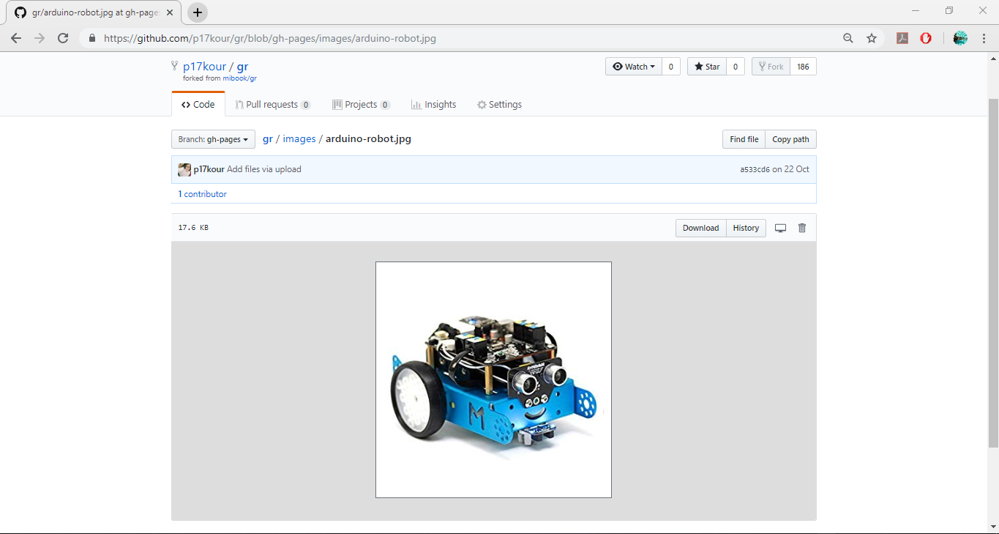
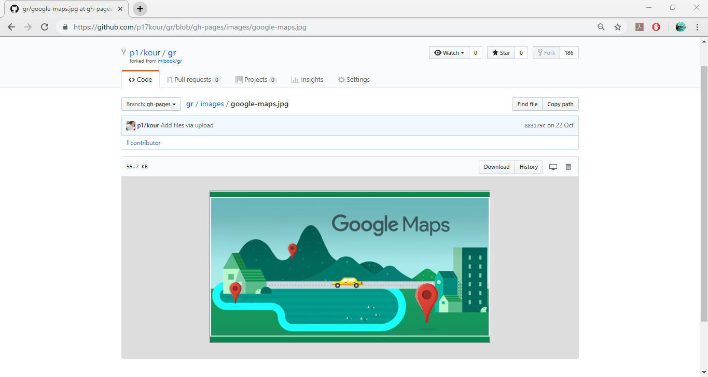
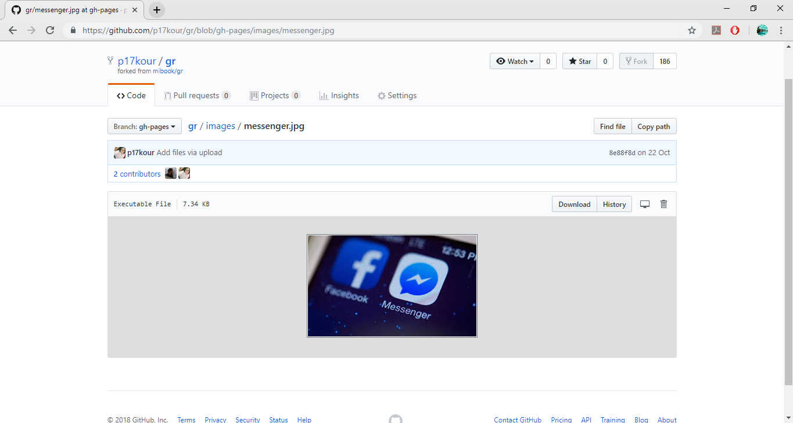
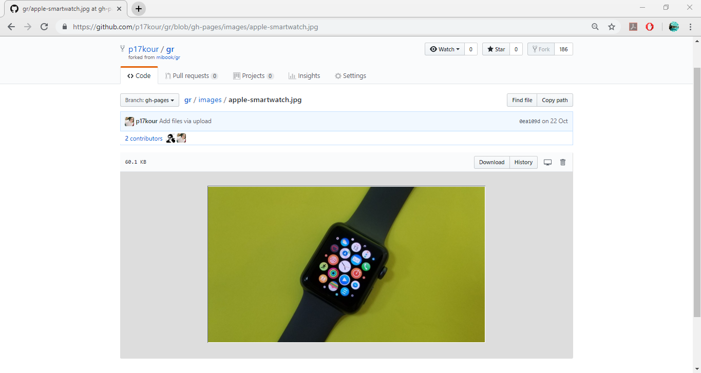
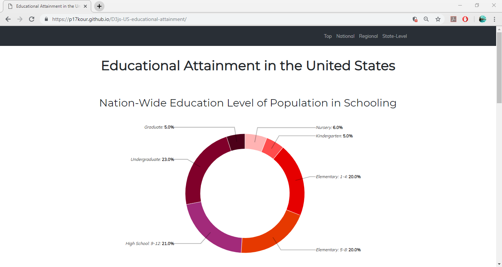
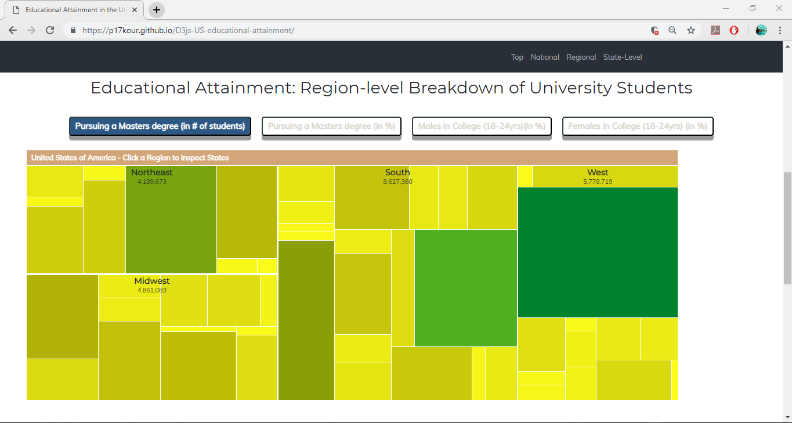
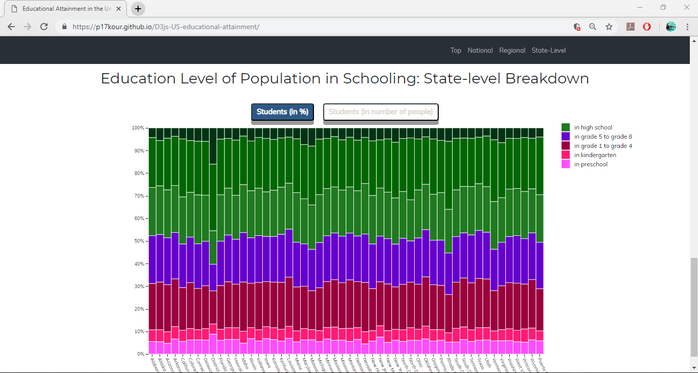

*Τελική αναφορά μαθήματος*

## Μάθημα: Επικοινωνία Ανθρώπου - Υπολογιστή(HCI)
  
Ονοματεπώνυμο: Αγγελική Κουρνέτα 

Αριθμός Μητρώου: Π2017019
  
### Σύντομη εισαγωγή
  
Στα πλαίσια του μαθήματος «Επικοινωνία Ανθρώπου- Υπολογιστή» του Γ’ εξαμήνου υλοποίησα τα ζητούμενα των προαπαιτούμενων παραδοτέων των εργασιών ανάπτυξης και περιεχομένου. Όσο αναφορά τα παραδοτέα του περιεχομένου δεν αντιμετώπισα κάποιο πρόβλημα, καθώς απάντησα σε όλα τα ερωτήματα κανονικά. Ωστόσο, τα παραδοτέα της ανάπτυξης είχαν ένα βαθμό δυσκολίας. Αν και το πρώτο παραδοτέο του ήταν σχετικά «εύκολο», το δεύτερο δεν κατάφερα να το υλοποιήσω.

### Σύνοψη
  
Στο μάθημα αυτό εμείς οι φοιτητές έπρεπε να κάνουμε εγγραφή στην σελίδα του [Github](https://github.com/), μέσα από το οποίο παρακολουθούσαμε τις σχετικές ανακοινώσεις και υλοποιούσαμε τις εργασίες του μαθήματος. Ακολουθώντας τις οδηγίες των καθηγητών, έκανα fork τα αποθετήρια που αφορούσαν τις εργασίες του μαθήματος HCI ([corses-ionio/hci](https://github.com/courses-ionio/hci), [ioniodi/D3js-US-educational-attainment](https://github.com/ioniodi/D3js-US-educational-attainment) και [mibook/gr](https://github.com/mibook/gr)). Έτσι, μέσα από την τελική μου αναφορά, παρουσιάζω τις εργασίες που παρέδωσα και αναλυτικά τις μεθόδους που χρησιμοποίησα για το τελικό έργο αυτών.

### Σύντομη ανάλυση σχετικών έργων και εργαλείων
  
Για την **Εργασία Περιεχομένου #1** χρησιμοποίησα φωτογραφίες από το διαδίκτυο και τις λεζάντες από το [Wikipedia](https://www.wikipedia.org/) και κάποιες γνώσεις δικιές μου. Επιπλέον, χρησιμοποίησα την εφαρμογή [Online Image Resizer](https://resizeimage.net/) για να μετατρέψω τις φωτογραφίες σε thumbnail.

Για την **Εργασία Περιεχομένου #2** χρησιμοποίησα την εφαρμογή [CodePen](https://codepen.io/) για να δημιουργήσω τα διαδραστικά παραδείγματα που ζητήθηκαν.

Για την **Εργασία Ανάπτυξης #1** χρησιμοποίησα τις εφαρμογές:

[HTML Color Picker]( https://www.w3schools.com/colors/colors_picker.asp) για να αλλάξω τα χρώματα στα γραφήματα.

[HTML5 Audio](https://www.w3schools.com/html/html5_audio.asp) για την δημιουργία κώδικά, ώστε να προσθέσω τον ήχο στο μενού της εφαρμογής.
  
### Ενδεικτικές οθόνες και animated gif

**Εργασία Περιεχομένου:**
  
*Παραδοτέο #1: Εικόνες με λεζάντα και με ελεύθερα πνευματικά δικαιώματα ή που επιτρέπουν εμπορική χρήση*

[Εκτελέσιμο link](https://p17kour.github.io/gr/)

[Link αποθετηρίου](https://github.com/p17kour/gr)

#### Ιστορικό

Στο προσωπικό μου αποθετήριο πρόσθεσα στο φάκελο [images](https://github.com/p17kour/gr/tree/gh-pages/images) 5 φωτογραφίες, μαζί με τις φωτογραφίες thumbnail,οι οποίες είναι με ελεύθερα πνευματικά δικαιώματα ή επιτρέπουν εμπορική χρήση. Έπειτα πρόσθεσα στο φάκελο [gallery](https://github.com/p17kour/gr/tree/gh-pages/_gallery) τις λεζάντες των φωτπγραφιών. Πιο αναλυτικά, πρόσθεσα τις εικόνες:
  
[Arduino Robot](https://p17kour.github.io/gr/gallery/arduino-robot/) 

[Google Map](https://p17kour.github.io/gr/gallery/google-maps/)

[Messenger](https://p17kour.github.io/gr/gallery/messenger/)

[Social Media](https://p17kour.github.io/gr/gallery/social-media/)

  
[Apple Smartwatch](https://p17kour.github.io/gr/gallery/apple-smartwatch/)

*Παραδοτέο #2: Διαδραστικά παραδείγματα*

[Εκτελέσιμο link](https://p17kour.github.io/gr/)

[Link αποθετηρίου](https://github.com/p17kour/gr)

#### Ιστορικό 

Στο προσωπικό μου αποθετήριο πρόσθεσα τα δύο διαδραστικά παραδείγματα που ζητήθηκαν στο φάκελο [remix](https://github.com/p17kour/gr/tree/gh-pages/_remix). Συγκεκριμένα, τα δύο διαδραστικά παραδείγματα είναι:

[Loading](https://p17kour.github.io/gr/remix/login/)
Προσθέτω εικόνα gif

[Login](https://p17kour.github.io/gr/remix/loading/)
Προσθέτω εικόνα gif

**Εργασία Ανάπτυξης:**
  
*Παραδοτέο #1: Οπτικοποίηση Δεδομένων*

[Εκτελέσιμο link]( https://p17kour.github.io/D3js-US-educational-attainment/)

[Link αποθετηρίου](https://github.com/p17kour/D3js-US-educational-attainment/)

### Ιστορικό 

Εκπλήρωσα τα ζητούμενα του **Παραδοτέου #1** στο προσωπικό μου αποθετήριο του κώδικά μου. Πιο συγκεκριμένα:

1. στον φάκελο [scripts](https://github.com/p17kour/D3js-US-educational-attainment/tree/master/assets/scripts) άλλαξα τα χρώματα στα γραφήματα 1,2 και 3.

 

 

2. στον φάκελο [stylesheets](https://github.com/p17kour/D3js-US-educational-attainment/tree/master/assets/stylesheets) αντικατέστησα τις διεπαφές στα «κουμπιά» του 2ου και 3ου γραφήματος με άλλες τις επιλογής μου.
Προσθέτω εικόνα gif

Επίσης, στον φάκελο [idext.html](https://github.com/p17kour/D3js-US-educational-attainment/blob/master/index.html):

1. όταν το ποντίκι διέρχεται πάνω από κάθε επιλογή του menu της σελίδας, ακούγεται ο ήχος της επιλογής μου.
Προσθέτω εικόνα gif

2. όταν το ποντίκι διέρχεται πάνω από κάποια πρόταση/κείμενο της σελίδας στα γραφήματα, ακούγεται αυτόματα η αφήγηση του κειμένου (text-to-speech0.
Προσθέτω εικόνα gif

3. εφάρμοσα responsive design στη σελίδα και κυρίως στο αρχικό menu της σελίδας έτσι ώστε να προσαρμόζεται σε οθόνες διαφορετικών διαστάσεων.
Προσθέτω εικόνα gif

### Συμπέρασμα

Κλείνοντας, θα μπορούσα να πω ότι η εμπειρία μου στις εργασίες ήταν καλή. Πρώτα απ' όλα έμαθα πράγματα που δεν ήξερα, όπως η εφαρμογή **Github**, αλλά και άλλες μεθόδους που θα με βοηθήσουν πολύ στο άμεσο μέλλον.
